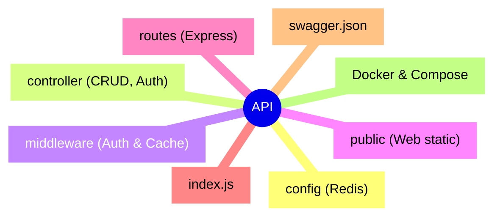

  

# My_YT_api

 

    
    
    
 

## Features of the project

### This project was about making an API where we had to find a topic,get a lot of row data, and we had specification to respect:

- **User authentification in order to administer the data**

- **OAuth login**

- **CRUD requests**

- **Get must have a pagination with a maximum of 20 elements**

- **Redis cache**

- **Documentation with swagger**

- **Postman Documentation**

##  Tech Stack
- **Runtime** : Node.js
- **Framework** : Express.js
- **Cache** : Redis 
- **Authentication and security** : Bcrypt, Google OAuth 2.0, JWT
- **Documentation** : Swagger UI Express, OpenAPI 3.0, Postman
- **DevOps** : Docker & Docker Compose

### Project Structure
---

### End Point
---
### Authentification

| Méthode | Route | Description |
| :--- | :--- | :--- |
| `POST` | `/login` | Admin login (username + password) ➔ Returns a JWT token |
| `GET` | `/auth/login` | Redirecting to the Google OAuth authentication page |
| `GET` | `/auth/callback` | Callback Google OAuth |

### YTAPI

| Méthode | Route | Auth requise | Description |
| :--- | :--- | :---: | :--- |
| `GET` | `/YTAPI?page=1` |  No | Paginated list of creators (20 per page, cached) |
| `GET` | `/YTAPI/:id` |  No | Creator details by ID (cached) |
| `POST` | `/YTAPI` |  yes | Add a new creator (name, subscribers, theme) |
| `PUT` | `/YTAPI/:id` |  yes | Update a creator's information |
| `DELETE` | `/YTAPI/:id` |  yes | Delete a creator |

---

### GitHub : <a href="https://github.com/LamourMathys">LamourMathys</a>